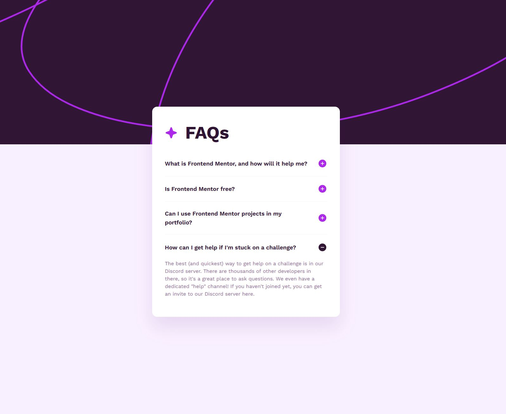
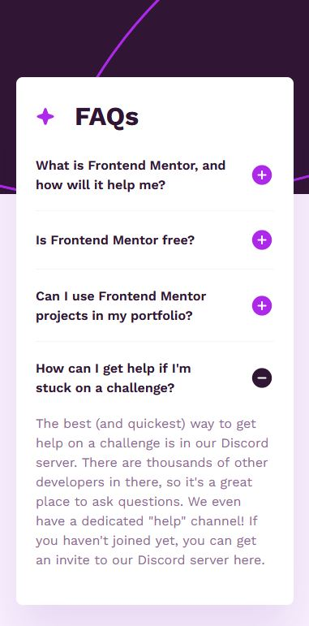

# FAQ accordion

This is a solution to the [FAQ accordion challenge on Frontend Mentor](https://www.frontendmentor.io/challenges/faq-accordion-wyfFdeBwBz). Frontend Mentor challenges help you improve your coding skills by building realistic projects.

## Table of contents

- [FAQ accordion](#faq-accordion)
  - [Table of contents](#table-of-contents)
  - [Overview](#overview)
    - [The challenge](#the-challenge)
    - [Screenshots](#screenshots)
    - [Links](#links)
  - [My process](#my-process)
    - [Built with](#built-with)
    - [Code Quality with](#code-quality-with)
    - [Some code I'm proud of](#some-code-im-proud-of)
  - [Author](#author)

## Overview

### The challenge

Users should be able to:

- Hide/Show the answer to a question when the question is clicked
- Navigate the questions and hide/show answers using keyboard navigation alone
- View the optimal layout for the interface depending on their device's screen size
- See hover and focus states for all interactive elements on the page

### Screenshots




### Links

- Solution URL: [https://github.com/tatasadi/faq-accordion](https://github.com/tatasadi/faq-accordion)
- Live Site URL: [https://faq-accordion-ta.vercel.app](https://faq-accordion-ta.vercel.app)

## My process

### Built with

   
  

### Code Quality with

 

### Some code I'm proud of

Building a compound component for Accordion:

Accordion:

```typescript
import React, {
  useState,
  cloneElement,
  Children,
  ReactElement,
  JSXElementConstructor,
} from "react"

const Accordion = ({ children }: { children: React.ReactNode }) => {
  const [openIndex, setOpenIndex] = useState<number | null>(null)

  const handleToggle = (index: number) => {
    setOpenIndex(openIndex === index ? null : index)
  }

  return Children.map(children, (child, index) => {
    if (React.isValidElement(child)) {
      return cloneElement(
        child as ReactElement<any, string | JSXElementConstructor<any>>,
        {
          isOpen: index === openIndex,
          onToggle: () => handleToggle(index),
        },
      )
    }
    return child
  })
}

export default Accordion
```

AccordionItem:

```typescript
import Image from "next/image"

const AccordionItem = ({
  isOpen = false,
  onToggle = () => {},
  title,
  children,
}: {
  isOpen?: boolean
  onToggle?: () => void
  title: string
  children: React.ReactNode
}) => (
  <div className="border-light-pink w-full cursor-pointer border-b-[0.0625rem] last:border-b-0">
    <div
      onClick={onToggle}
      className="hover:text-pink flex w-full items-center gap-6 py-5 font-semibold lg:py-6 lg:text-lg"
    >
      <h3>{title}</h3>
      <Image
        width={30}
        height={30}
        src={`/images/icon-${isOpen ? "minus" : "plus"}.svg`}
        alt={`icon arrow ${isOpen ? "minus" : "plus"}`}
        className="ml-auto"
      />
    </div>
    {isOpen && (
      <p className="text-grayish-purple pb-5 lg:leading-6">{children}</p>
    )}
  </div>
)

export default AccordionItem

```

Usage:

```typescript
<Accordion>
  <AccordionItem title="What is Frontend Mentor, and how will it help me?">
    Frontend Mentor offers realistic coding challenges to help
    developers improve their frontend coding skills with projects in
    HTML, CSS, and JavaScript. It’s suitable for all levels and ideal
    for portfolio building.
  </AccordionItem>
  <AccordionItem title="Is Frontend Mentor free?">
    The majority of our challenges are free, yes. We do have some that
    are premium and require a Pro subscription to access. It will say
    on each challenge whether they are free or premium, so it's easy
    to tell the difference.
  </AccordionItem>
  <AccordionItem title="Can I use Frontend Mentor projects in my portfolio?">
    Definitely! Please do feel free to use whatever you build in your
    portfolio. Helping developers add professional-looking projects to
    their portfolio was one of the reasons we created this platform!
  </AccordionItem>
  <AccordionItem title="How can I get help if I'm stuck on a challenge?">
    The best (and quickest) way to get help on a challenge is in our
    Discord server. There are thousands of other developers in there,
    so it's a great place to ask questions. We even have a dedicated
    "help" channel! If you haven't joined yet, you can get an invite
    to our Discord server here.
  </AccordionItem>
</Accordion>
```

## Author

- Website - [Ehsan Tatasadi](https://ehsan.tatasadi.com)
- Frontend Mentor - [@tatasadi](https://www.frontendmentor.io/profile/tatasadi)
- GitHub - [@tatasadi](https://github.com/tatasadi)
- Linkedin - [Ehsan Tatasadi](https://www.linkedin.com/in/ehsan-tatasadi-2161a433)
- Twitter - [@etatasadi](https://twitter.com/etatasadi)
